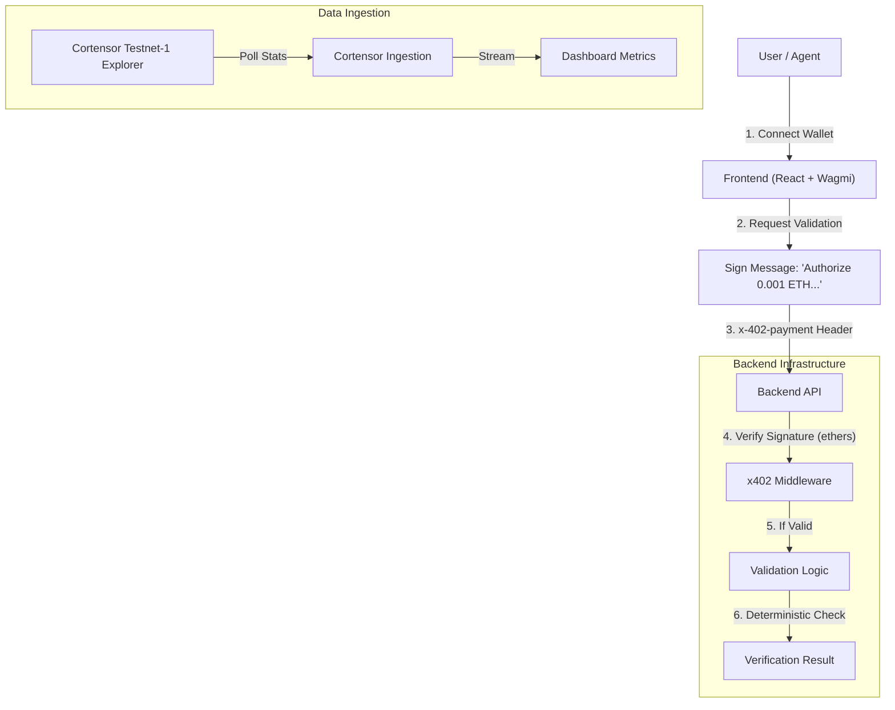

# CORWatch x402 🛡️

[](https://opensource.org/licenses/MIT)
[](https://cortensor.network)
[](https://x402.org)

**CORWatch x402** is a decentralized observability and validation platform for the Cortensor network, enabling real-time trust scoring and premium evidence validation using the **x402 Payment Protocol**.

## 🎥 Demo & Repository

- **Repository**: [https://github.com/Ayush1832/CORWatch-x402](https://github.com/Ayush1832/CORWatch-x402)
- **Live Demo**: [https://cor-watch-x402.vercel.app/](https://cor-watch-x402.vercel.app/)

## 🏗️ Architecture

The system bridges a React frontend with a Node.js backend using cryptographic signatures for payment authorization (x402), enabling "pay-per-request" validation logic.



## 🚀 Quick Start

### Prerequisites

- Node.js v18+
- MetaMask / WalletConnect (Sepolia Network)

### Runbook

1.  **Clone the Repository**

    ```bash
    git clone https://github.com/Ayush1832/CORWatch-x402.git
    cd CORWatch-x402
    ```

2.  **Start Backend** (Port 3000)

    ```bash
    cd backend
    npm install
    npm run dev
    ```

3.  **Start Frontend** (Port 5173)

    ```bash
    cd ../frontend
    npm install
    npm run dev
    ```

4.  **Access the DApp**
    - Open `http://localhost:5173`.
    - Connect your wallet (forced to **Sepolia**).

## 🛡️ For Validators: Verification Spec

The `/validate` endpoint provides transparent, deterministic verification of session integrity.

- **Deterministic Check**: The backend calculates a SHA-256 hash of the `sessionId`. This hash seeds a deterministic result generator.
  - _Input_: `sessionId` (String)
  - _Process_: `SHA256(id) -> Seed -> Score/ValidatorCount`
  - _Output_: Verified (Score > 0.7) or Disputed.
- **Rubric Prompts**:
  > "Given the session ID, verify that the agreement score exceeds 0.90 among at least 5 independent miners."
- **x402 Implementation**:
  - Authentication is **not** based on cookies/JWTs.
  - Authentication is based on a **cryptographic signature** of the intent passed in the `x-402-payment` HTTP header.

## 🤖 For Agents: Tool & Safety

Design for autonomous agents (e.g. via LangChain/Autogen) to interact with CORWatch.

### Action List

1.  **`check_network_status`**: GET `/api/v2/stats` (via Cortensor Explorer integration).
2.  **`validate_session`**: POST `/validate` with `{ sessionId: "..." }`.
    - _Requires_: `x-402-payment` header containing ECDSA signature.

### Safety Guardrails

- **Payment Limits**: Frontend prompts explicitly for `0.001 ETH` max per transaction.
- **Network Enforcement**: AppKit configuration forces `Sepolia` to prevent mainnet fund loss.
- **Fallback Stability**: The Cortensor Ingestion engine gracefully degrades to simulation if the Testnet Explorer is unreachable.

## 📄 License

This project is licensed under the **MIT License**. See the `LICENSE` file for details.
